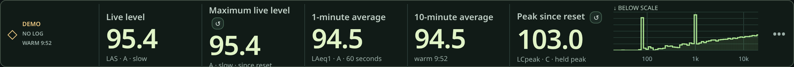
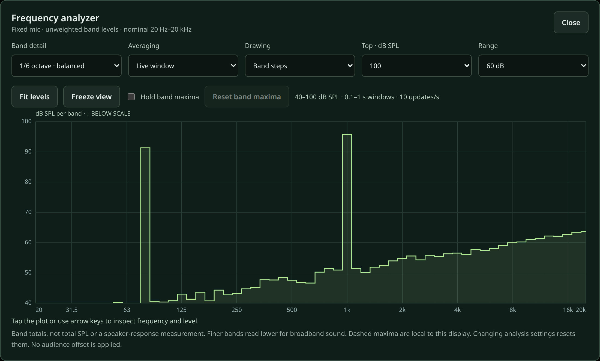
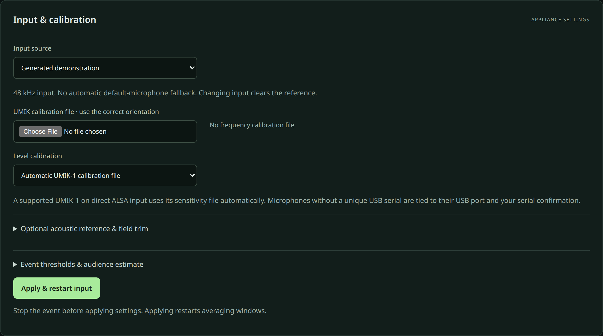
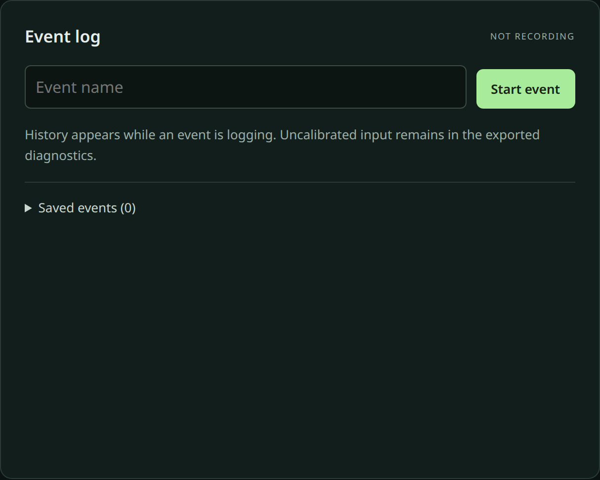
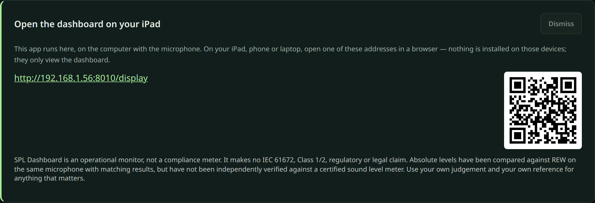

# SPL Dashboard

SPL Dashboard is a sound-pressure-level (SPL) monitor for live events. You run it
on the computer that has your measurement microphone plugged in; it does all the
audio capture, calibration and metering there and serves a live dashboard on your
local network. An iPad, phone or laptop on the same Wi-Fi opens the dashboard in a
web browser — those devices only ever receive numbers, never audio.



## How it fits together

```text
   ┌─────────────┐      USB      ┌────────────────────────────┐
   │ Measurement │ ────────────▶ │  Computer running          │
   │ microphone  │               │  SPL Dashboard             │
   └─────────────┘               │  (capture · DSP · logging) │
                                 └──────────────┬─────────────┘
                                                │ your Wi-Fi / LAN
                        ┌───────────────────────┼───────────────────────┐
                        ▼                       ▼                        ▼
                     iPad browser          phone browser           laptop browser
                     (views /display)      (views dashboard)       (admin console)
```

**This does not install on an iPad.** The iPad (or phone, or other laptop) only
*views* the dashboard in its web browser. The one and only thing you install is
`spl-dashboard`, on the computer with the microphone.

## Which setup is for me?

| Your situation | What to do |
| --- | --- |
| **Laptop only** — you mix and monitor on the same machine | Install and run `spl-dashboard`; open `http://localhost:8000/display` on the same laptop. |
| **Laptop + iPad** — you want a big readout at front of house | Run `spl-dashboard` on the laptop; open the LAN `/display` URL it prints on the iPad's browser. |
| **Dedicated box** — a small always-on Linux computer at the mic | Install it as a service on that box; see [operator deployment](docs/deployment.md). |

## Install and run

First install [uv](https://docs.astral.sh/uv/) (a single small tool), then run the
dashboard with `uvx`.

**Linux** — install the PortAudio runtime first (once):

```bash
sudo apt install libportaudio2        # Debian/Ubuntu; other distros: your equivalent
curl -LsSf https://astral.sh/uv/install.sh | sh
uvx spl-dashboard
```

**macOS:**

```bash
curl -LsSf https://astral.sh/uv/install.sh | sh
uvx spl-dashboard
```

**Windows** (PowerShell):

```powershell
powershell -ExecutionPolicy ByPass -c "irm https://astral.sh/uv/install.ps1 | iex"
uvx spl-dashboard
```

macOS and Windows get PortAudio automatically from the `sounddevice` package;
only Linux needs `libportaudio2` installed separately.

When it starts, it prints the address to open on this computer and the addresses
to open on other devices on your network. New here? Follow the
**[getting-started walk-through](docs/getting-started.md)**.

### Upgrade

```bash
uvx spl-dashboard@latest        # run the newest release
```

## What you'll see

| | |
| --- | --- |
|  |  |
| The spectrum analyzer | Input & calibration |
|  |  |
| The event log | The getting-started banner |

## Documentation

- **[Documentation index](docs/README.md)** — everything, organised by audience.
- [Getting started](docs/getting-started.md) · [Calibration guide](docs/calibration-guide.md) · [Troubleshooting](docs/troubleshooting.md)

## Important: what this is, and is not

> SPL Dashboard is an operational monitor, not a compliance meter. It makes no
> IEC 61672, Class 1/2, regulatory or legal claim. Absolute levels have been
> compared against REW on the same microphone with matching results, but have
> not been independently verified against a certified sound level meter. Use
> your own judgement and your own reference for anything that matters.

## License

Copyright (C) 2026 ghreprimand.

SPL Dashboard is licensed under **GPL-3.0-only** (GNU General Public License,
version 3 only). See [LICENSE](LICENSE) for the full terms. This program is
distributed without any warranty; see the license for details. Third-party
dependencies retain their respective licenses.
